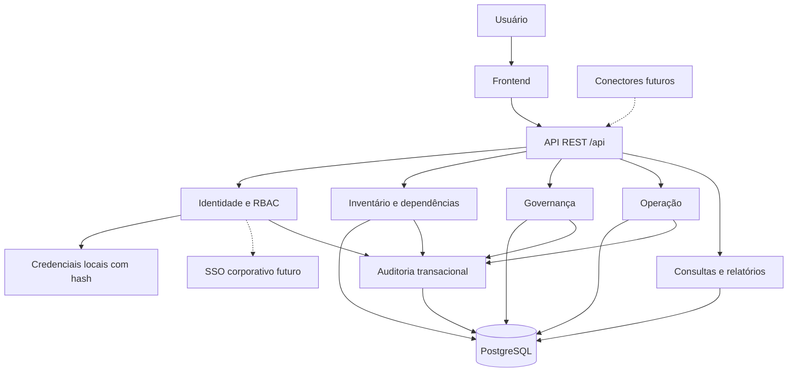

# Arquitetura técnica — Gestão e Inventário de Automações

Base: [spec.md](spec.md), versão 1.0, de 06/09/2026. Documentos complementares: [db.md](db.md), [api.md](api.md), [ui.md](ui.md).

## 1. Escopo e natureza das decisões

A plataforma gerencia automações existentes como ativos operacionais. Abrange inventário, responsáveis, processos, sistemas, dependências, versões implantadas, documentação, governança, execução registrada, incidentes e auditoria. Registrar uma execução não dispara a automação. Status e versões são metadados do inventário e não comandam orquestradores externos.

Não implementar IDE, edição de código, branches, pull requests, builds, CI/CD ou execução de automações. Essas exclusões não impedem testes automatizados e práticas de entrega da própria plataforma (§§3, 54–55).

Os requisitos funcionais vêm do `spec.md`, com decisões posteriores do usuário registradas em [decisions.md](decisions.md). Uso interno de uma organização/grupo, stack Python/FastAPI + React/TypeScript + PostgreSQL, execução dockerizada e hospedagem interna on-premises estão confirmados. Login local precede SSO. Stack, contratos, estruturas físicas e fórmulas adicionais abaixo são **decisões técnicas propostas para orientar a implementação**, não escolhas já aprovadas pela especificação nem funcionalidades já implementadas. Infraestrutura corporativa, provedor de identidade e metas de serviço ainda precisam de definição antes da produção.

## 2. Arquitetura proposta

Adotar monólito modular com frontend separado, API REST e banco relacional compartilhado. A separação ocorre por responsabilidades e interfaces internas; não exige microsserviços no MVP (§52).

| Camada | Proposta | Responsabilidade |
| --- | --- | --- |
| Frontend | React + TypeScript | Navegação, formulários, tabelas, dashboards e grafo básico |
| API | Python + FastAPI | Contratos REST, autenticação, autorização e validação |
| Aplicação/domínio | Módulos Python | Casos de uso, regras, indicadores e transações |
| Persistência | PostgreSQL + SQLAlchemy + Alembic | Integridade, consultas e migrations versionadas |
| Identidade | Login local com e-mail/senha; adaptador OIDC futuro | Sessões revogáveis e RBAC na aplicação |
| Relatórios | Geração no backend | CSV, XLSX e PDF com os mesmos filtros e permissões |
| Documentação de automações | Referências externas no MVP | URLs e metadados, sem upload inicial |

Versões iniciais e ferramentas foram fixadas na DEC-007 de [decisions.md](decisions.md), com manifests/lockfiles em backend e frontend; imagens ainda precisam de build e digest verificados. Docker Compose será a base de execução inicial em servidor interno on-premises; especificações do host e configuração operacional ainda serão levantadas. SSO/OIDC e federação SAML/AD/LDAP ficam para evolução posterior. O MVP usa autenticação local real, sem depender de IdP externo.

## 3. Módulos e organização

| Módulo | Dados e responsabilidades |
| --- | --- |
| identity | Usuários, roles, permissões, escopos, vínculo com IdP |
| organization | Empresas, áreas, processos/subprocessos, equipes e membros |
| inventory | Automações, responsáveis, tecnologia, versões, sistemas e referências de credenciais |
| dependencies | Tipos de dependência, componentes, relações e impacto direto |
| governance | Documentos, checklist, revisões, avaliações de risco e parâmetros |
| operations | Registros de execução, incidentes e saúde |
| reporting | Busca, agregações, dashboards e exportações |
| audit | Eventos imutáveis de alteração e consultas autorizadas |
| integrations | Interfaces de ingestão e adaptadores futuros, sem conectores no MVP |

Estrutura sugerida: `backend/app/modules/<modulo>/{router,schemas,service,repository,models}.py`, `backend/migrations/`, `backend/tests/`, `frontend/src/features/<modulo>/`, `frontend/src/shared/`, `docs/` para documentação e planos. Os documentos técnicos estão em `docs/`; acompanhar entregas e checklists em [implementation-plan.md](implementation-plan.md).

Routers tratam HTTP; services executam autorização e regras; repositories acessam o banco. Evitar alterações diretas entre tabelas de módulos sem passar por seus casos de uso. Funções compartilhadas de escopo devem atender consultas, detalhes, relações, métricas e exportações.

## 4. Regras consolidadas e ambiguidades resolvidas por proposta

| Tema | Regra de implementação proposta | Origem |
| --- | --- | --- |
| Identidade | UUID interno e código `AUT-` com sequência de no mínimo seis dígitos, imutável, sem reutilização | §7, RN-001 |
| Owners | Cadastro exige business owner, technical owner e equipe ativos; atualizações de automação ATIVA preservam isso | §§6, 11, RN-002–004 |
| Órfãs | Inativação posterior de usuário/equipe preserva FK e gera pendência; não apaga nem muda silenciosamente o status da automação | §29 |
| Backup | Obrigatório para ALTA e CRITICA, aplicando a regra mais abrangente do §11; RN-005 cita apenas CRITICA | §11, RN-005 |
| Versão atual | Cadastro cria versão inicial; ponteiro identifica a implantada, independentemente da ordenação do rótulo | §20, RN-011 |
| Descontinuação | Status DESCONTINUADA mantém visibilidade normal e histórico | §§8, 46 |
| Exclusão lógica | Ação administrativa separada preenche deleted_at/by/reason e retira das consultas padrão | §46 |
| Dados obrigatórios | Não aceitar ausência de criticidade/classificação em novos registros; indicadores de ausência atendem dados legados futuros | RN-009–010, §31 |
| Dependências críticas | Impedir salvar relação CRITICA com mandatory=false; revisão exige declarar se o mapeamento está completo | RN-012 |
| Limite do mapeamento | O sistema não pode descobrir dependências omitidas sem integração; conclusão do mapeamento é declaração auditada do responsável | §§13, 27 |
| MVP | P0 é primeira entrega; MVP aceito inclui também documentação, revisões, governança mínima, identificação de inatividade e exportação exigidas em §§50 e 59 | §§50–51, 59 |
| Importação | Cadastro manual satisfaz a alternativa “importados/cadastrados”; importação em lote fica para evolução sem contrato aprovado | §59 |
| Risco | Avaliação manual com cálculo determinístico no MVP; coleta automática de fatores permanece P2 | §§17, 51 |

Automações órfãs por inativação continuam visíveis com alerta. Uma correção pode atribuir os três responsáveis em uma mesma transação. Não bloquear registro de incidentes ou execuções por uma pendência de owner. Não excluir usuários/equipes referenciados. Não introduzir estado de desenvolvimento ou aprovação de código.

## 5. Fluxos e consistência

**Cadastro:** autenticar → validar `automation.create` e escopo da área → validar campos, owners e equipe → reservar código → gravar automação e versão inicial → definir revisão inicial → gravar auditoria → commit. Falha em qualquer etapa reverte a transação, embora a sequência possa ter lacunas.

**Atualização:** carregar registro dentro do escopo → validar permissão por grupo de campos → conferir revisão de concorrência → validar estado final → atualizar → registrar diferenças no AuditLog → commit. Mudança crítica exige motivo. Não permitir atualização genérica de código, auditoria, exclusão ou ponteiro da versão atual.

**Versão:** criar versão histórica sem necessariamente torná-la atual. A promoção explícita altera o ponteiro atual e audita antigo/novo na mesma transação. Uma versão já existente pode voltar a ser atual para registrar rollback operacional externo.

**Dependência:** validar acesso à origem e ao destino → impedir autorrelação e duplicação → validar tipo/destino e obrigatoriedade → persistir e auditar. Consulta de impacto retorna automações diretamente dependentes; transitividade é futura. Ciclos entre ativos distintos podem representar o ambiente real: mostrar advertência sem bloquear cadastro e usar nós visitados no grafo.

**Revisão:** registrar participantes, checklist, observações e resultado. Revisão concluída atualiza última/próxima revisão em transação. Revisão pendente de correção não renova prazo.

**Auditoria:** escrita síncrona na mesma transação da mudança; falha de auditoria impede commit. Logs operacionais não substituem AuditLog. Nenhum perfil, inclusive administrador, dispõe de API para reescrever o histórico.

## 6. Indicadores compartilhados

Estas fórmulas foram adotadas como baseline técnica configurável na DEC-008 para fechar lacunas dos §§17, 24, 27–30; validação corporativa ocorre no aceite. Backend calcula valores; interface apenas apresenta. Todos os resultados incluem `as_of` e parâmetros/janela utilizados. Ausência de observação não equivale a zero ou sucesso.

| Indicador | Definição inicial |
| --- | --- |
| Risco | impacto × probabilidade × exposição, fatores inteiros 1–5; faixas 1–20 BAIXO, 21–40 MEDIO, 41–60 ALTO, 61–125 CRITICO |
| Saúde | Janela configurável, inicialmente 30 dias; SUCCESS / total de execuções finais × 100; WARNING, ERROR, CANCELLED e TIMEOUT entram no denominador |
| Faixas de saúde | Sem registros: SEM_DADOS; ≥95%: SAUDAVEL; ≥80% e <95%: ATENCAO; <80%: CRITICA; limites configuráveis |
| Tempo médio | Média de duration_ms nas execuções com início/fim válidos da janela; sem amostras: null |
| Falhas consecutivas | Sequência recente de ERROR/TIMEOUT, ordenada por started_at e id; qualquer outro status interrompe; limiar inicial 3 |
| Erros | ERROR/TIMEOUT na janela; “com erro” conta automações distintas com pelo menos um desses resultados |
| Sem utilização | Último started_at, ou entry_date se nunca executou, anterior a hoje menos o limite configurado; limite inicial 30 dias, faixas >30/>60/>90 sem contagem duplicada |
| Revisão | Vencida: next_review_date < hoje; próxima: entre hoje e hoje + 30 dias; em dia: posterior; ausente: SEM_DATA |
| Periodicidade | BAIXA/MEDIA: 12 meses; ALTA/CRITICA: 6 meses; soma por meses de calendário, ajustando ao último dia válido |
| Órfã | Owner obrigatório ausente/inativo ou equipe ausente/inativa; backup faltante é indicador separado |
| Governança | Itens satisfeitos / itens aplicáveis × 100; sem itens aplicáveis: null |

Checklist inicial: business owner ativo, technical owner ativo, documento funcional e técnico válidos, criticidade, classificação, dependências mapeadas, sistemas mapeados, versão atual, link de monitoramento, contingência documentada e última revisão concluída. Backup é item adicional aplicável a ALTA/CRITICA. Dependências/sistemas podem ser declarados não aplicáveis com justificativa auditada, exceto dependências críticas conhecidas. A declaração de mapeamento evita inferir completude apenas pela existência de uma relação.

Frequência textual não permite calcular atraso com precisão. SLA, atraso e disponibilidade ficam informativos até existir calendário operacional; não entram silenciosamente na saúde. Incidentes aparecem como indicadores separados inicialmente. Alteração dos parâmetros é auditada; avaliações de risco e revisões armazenam a versão da política usada.

Usar timestamps UTC e fuso organizacional configurável para “hoje” e intervalos por data. Métricas padrão excluem soft-deleted; distribuições de inventário incluem DESCONTINUADA, enquanto listas de ação operacional excluem DESCONTINUADA. Informar explicitamente essa população nas respostas e telas.

## 7. Segurança e autorização

Aplicar RBAC conforme a matriz de [api.md](api.md): gestor e auditor consultam todas as áreas; gestor edita somente áreas atribuídas, auditor não altera registros, técnicos e responsáveis de negócio mantêm escopos de responsabilidade/processo. Permissões por campo e de auditoria continuam independentes da leitura global. Filtrar no banco antes de paginar e agregar. Validar também campos, relações, destinos do grafo e relatórios; esconder um botão não protege a API.

TLS em trânsito, banco e backups criptografados em repouso, conta de banco com privilégio mínimo e segredos da própria implantação fornecidos por infraestrutura protegida. Para automações, a plataforma armazena somente referências de credenciais, nunca conteúdo de senha/token/chave. Para login da própria plataforma, persistir hash Argon2id em tabela separada, nunca senha recuperável. Corpo de requisições, erros, auditoria e logs não devem copiar secrets. Não buscar automaticamente URLs de documentos ou Secret Managers no MVP.

Validar e-mail/senha local com hash Argon2id, proteção contra tentativas repetidas, respostas genéricas e sessões opacas revogáveis. Mudança/recuperação de senha revoga sessões. No futuro SSO, validar emissor, audiência, validade e assinatura. Revogação/inativação local impede acesso em ambos os modos. Contratos em [api.md](api.md). Logs estruturados incluem request_id, ator, ação, duração e resultado, sem tokens ou conteúdo sensível.

## 8. Implantação, desempenho e operação

Destino de implantação: infraestrutura interna on-premises com Docker Compose. Ambientes separados: desenvolvimento com dados fictícios, homologação e produção, com configurações e volumes próprios. HTTPS termina no proxy interno e PostgreSQL não tem porta pública. Definir host, DNS, certificados, armazenamento e responsáveis antes do deploy; uma instalação em host único não comprova alta disponibilidade. Configuração por ambiente, migrations versionadas e execução controlada antes de subir código dependente. Revisar compatibilidade das migrations e preparar recuperação antes de alterações destrutivas de esquema.

Sessões de autenticação ficam em armazenamento compartilhado protegido (tabela de sessões no PostgreSQL no MVP); cookies carregam apenas identificador opaco. API sem estado de negócio local permite múltiplas réplicas. Um worker do mesmo código processa export_job com aquisição atômica de jobs e armazenamento privado compartilhado de artefatos; broker externo não é obrigatório. Jobs interrompidos possuem timeout e recuperação controlada para não permanecerem RUNNING indefinidamente. PostgreSQL é a fonte de verdade. Inicialmente calcular indicadores por consultas agregadas e índices; introduzir cache/materialização ou jobs somente com evidência de necessidade. Não exigir broker ou motor de grafo para relações diretas em 10.000+ automações.

Meta proposta para homologação: busca paginada p95 ≤1 segundo com 10.000 automações e 20 consultas concorrentes em ambiente registrado. É meta a validar, não SLA estabelecido pelo spec. Evitar N+1, limitar paginação e acompanhar planos de consulta. Exportações grandes seguem processamento de jobs definido em [api.md](api.md).

Expor verificações de vivacidade e prontidão sem detalhes de infraestrutura ao público. Observar latência, erros, saturação de conexões e falhas de jobs. Política de retenção, RPO/RTO, disponibilidade, capacidade e implantação definitiva dependem da organização. Validar restauração de backup; não confundir backup existente com recuperação testada.

## 9. Entregas e validação

| Etapa | Entrega | Evidência de conclusão |
| --- | --- | --- |
| 1 Fundação | Banco/migrations, identidade, RBAC, organização e auditoria | Login, bloqueio por escopo, transação revertida se auditoria falhar |
| 2 Inventário | Cadastro, responsáveis, classificação, versão inicial, busca | RN-001–011 aplicáveis e concorrência cobertas |
| 3 Dependências | Sistemas, componentes, relações e grafo básico | Integridade e navegação nos dois sentidos; impacto direto |
| 4 Governança | Documentação, revisão, checklist e avaliação manual de risco | Fórmulas, vencimento, owners inativos e políticas configuráveis |
| 5 Operação | Registro manual de execuções, saúde e incidentes | Indicadores com/sem dados e datas-limite testados |
| 6 Consolidação | Dashboards, exportações e acessibilidade dos fluxos | Critérios §§50/59 completos, filtros e RBAC preservados |
| 7 Evolução | Integrações, alertas, impacto indireto e métricas de valor | Contratos externos e critérios próprios definidos |

Testes unitários: regras, permissões, risco, saúde, revisão e governança. Integração: API/banco/identidade, soft delete, auditoria, FKs, concorrência e exportação. Interface: login → listagem → cadastro → edição → dependência → versão → auditoria, incluindo usuário sem permissão. Testes de carga devem registrar volume, hardware e resultados.

Seed idempotente com as quatro automações do §56, owners, backup para ALTA/CRITICA, equipes, sistemas, versões, documentos, execuções e incidentes fictícios. Acrescentar exemplos de revisão vencida, sem execução e owner posteriormente inativado para validar os indicadores.

## 10. Decisões ainda dependentes da organização

Confirmar características da infraestrutura de destino, digests e execução das imagens, metas de disponibilidade/recuperação, retenção dos dados e aprovadores das políticas. Os valores iniciais de saúde e critérios de documentação são propostas explícitas destes documentos, passíveis de revisão conjunta antes da produção. Consulta global de gestor/auditor e hospedagem interna on-premises foram confirmadas em [decisions.md](decisions.md). Não há necessidade de inventar integrações para iniciar o domínio e seus testes.

O provedor de SSO será definido na evolução correspondente e não bloqueia o MVP com autenticação local. Bootstrap administrativo e recuperação de acesso devem ser verificáveis sem credenciais padrão ou secrets versionados.
