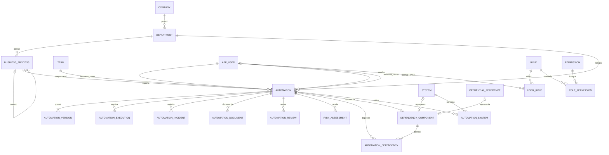

# Modelo de dados e dicionário

Base: [spec.md](spec.md), §§6–30 e 48–49. Arquitetura: [architecture.md](architecture.md). Contratos: [api.md](api.md). Este é um esquema PostgreSQL proposto, ainda não uma migration executada.

## 1. Convenções

Tabelas e campos em inglês `snake_case`; rótulos da UI em português. PKs UUID. Datas civis: `date`; instantes: `timestamptz` UTC. Strings curtas limitadas pela API; textos descritivos `text`. Colunas são NOT NULL salvo marcação `?`. `created_at` é gerado no servidor. Entidades mutáveis possuem `updated_at` e `revision bigint` (inicial 1), incrementado em cada alteração. Relações simples podem não precisar de revisão própria quando protegidas pela revisão do agregado.

`FK` indica referência com `ON DELETE RESTRICT`, salvo indicação explícita. Não usar cascata que remova histórico. Cadastros de organização e usuários são inativados com `is_active`; automações usam soft delete. Unicidade de códigos permanece inclusive após exclusão lógica. JSONB é reservado a snapshots, auditoria e parâmetros, não a relacionamentos sem integridade.

Valores persistidos/API sem acentos:

| Domínio | Valores |
| --- | --- |
| automation_status | ATIVA, PAUSADA, EM_MANUTENCAO, OBSOLETA, DESCONTINUADA |
| environment | PRODUCAO, CONTINGENCIA, DR, OUTRO |
| criticality | BAIXA, MEDIA, ALTA, CRITICA |
| data_classification | PUBLICO, INTERNO, CONFIDENCIAL, SENSIVEL |
| execution_status | SUCCESS, ERROR, WARNING, CANCELLED, TIMEOUT |
| health_status (calculado) | SAUDAVEL, ATENCAO, CRITICA, SEM_DADOS |
| risk_level | BAIXO, MEDIO, ALTO, CRITICO |
| system_type | ERP, CRM, API, BANCO_DE_DADOS, APLICACAO, SERVICO, FILA, ARQUIVO, INFRAESTRUTURA, OUTRO |
| incident_status (proposto) | ABERTO, EM_TRATAMENTO, RESOLVIDO, CANCELADO |
| review_result (proposto) | CONCLUIDA, PENDENTE_CORRECAO |

Usar CHECKs ou tabelas de domínio para valores estáveis. Tipos de dependência e categorias são cadastros configuráveis, não enum fechado.

## 2. Modelo entidade-relacionamento

As três relações opcionais de `dependency_component` são alternativas exclusivas, descritas abaixo. AuditLog referencia entidades por tipo/UUID para preservar histórico sem FK polimórfica. Tabelas auxiliares de membros, escopos, categorias e jobs são detalhadas no dicionário.

## 3. Identidade e organização

| Tabela | Campos específicos e restrições |
| --- | --- |
| company | id, name varchar(160), is_active boolean |
| department | id, company_id FK, name varchar(160), is_active; UNIQUE(company_id, name) |
| business_process | id, department_id FK, parent_id FK self ?, name varchar(160), description text ?, is_active |
| app_user | id, identity_subject varchar(255) ?, identity_issuer varchar(512) ?, name varchar(160), email varchar(254), is_active; UNIQUE(identity_issuer, identity_subject) quando preenchidos |
| team | id, department_id FK, name varchar(160), is_active; UNIQUE(department_id, name) |
| team_member | team_id FK, user_id FK; PK composta |
| role | id, code varchar(80) UNIQUE, name varchar(160), is_active |
| permission | id, code varchar(100) UNIQUE, description text |
| user_role | user_id FK, role_id FK; PK composta |
| role_permission | role_id FK, permission_id FK; PK composta |
| user_department_scope | user_id FK, department_id FK; PK composta |
| user_process_scope | user_id FK, business_process_id FK; PK composta |

Owners são usuários; não criar cadastro paralelo de pessoas. Usuário sem credencial local nem identidade externa vinculada pode ser owner, mas não autentica. E-mail normalizado deve ser único para o login local; manter UUID como identidade estável. Validar processo pai na mesma área e impedir ciclos hierárquicos. Subprocesso usa a mesma tabela e pode receber automações. Proposta: equipe responsável pertence à área da automação; owners podem atuar em mais de uma área.

`auth_session` (login local e SSO futuro): id UUID, session_token_hash UNIQUE, user_id FK, expires_at timestamptz, revoked_at timestamptz ?, csrf_token_hash, created_at. O cookie contém token aleatório cujo hash é persistido; não guardar tokens do IdP nesta tabela. Sessões expiradas/revogadas não autenticam. No SSO futuro, estado/nonce/PKCE usará armazenamento temporário protegido e expirará após o callback.

`local_credential`: user_id UUID PK/FK app_user, password_hash text (Argon2id), password_changed_at timestamptz, created_at, updated_at. Usuários sem credencial não fazem login local. Não adicionar hash aos snapshots do usuário nem retornar por API. Desabilitar acesso local remove/revoga a credencial sem remover o usuário histórico.

`password_reset_token`: id UUID, user_id FK, token_hash UNIQUE, expires_at timestamptz, consumed_at timestamptz ?, created_by FK, created_at. Persistir somente hash, consumir uma única vez em transação, invalidar tokens anteriores ao emitir novo e revogar sessões após a troca. O token original só existe na entrega protegida, nunca em logs/auditoria. Dados para limitação de tentativas precisam ser compartilhados entre réplicas; definir retenção/limites na implementação E2.

## 4. Automação

Tabela `automation`, com timestamps/revision comuns:

| Campo | Tipo | Regra |
| --- | --- | --- |
| id | uuid PK | Gerado pelo servidor |
| code | varchar(32) UNIQUE | Sequência permanente AUT-000001; imutável |
| name | varchar(200) | Obrigatório, não vazio |
| description, objective | text | Obrigatórios |
| business_process_id | uuid FK | Processo ou subprocesso ativo |
| department_id | uuid FK | Deve coincidir com a área do processo |
| status | varchar(24) | Domínio automation_status |
| environment | varchar(20) | Domínio environment |
| current_version_id | uuid | FK composta para versão da própria automação |
| criticality | varchar(10) | Obrigatória |
| data_classification | varchar(16) | Obrigatória |
| frequency | varchar(160) | Texto no MVP; não interpretar como cron |
| trigger | varchar(255) | Gatilho descritivo |
| sla | text ? | Registro descritivo |
| business_owner_id | uuid FK | Usuário ativo ao atribuir |
| technical_owner_id | uuid FK | Usuário ativo ao atribuir |
| backup_owner_id | uuid FK ? | Obrigatório para ALTA/CRITICA |
| team_id | uuid FK | Equipe ativa ao atribuir |
| entry_date | date | Entrada do ativo no inventário |
| last_review_date | date ? | Atualizada por revisão concluída |
| next_review_date | date | Inicialmente entry_date + periodicidade |
| documentation_url | text ? | Referência principal, complementada por documentos |
| repository_url, monitoring_url | text ? | Referências externas |
| contains_sensitive_data | boolean | SENSIVEL implica true; true não permite PUBLICO/INTERNO |
| data_categories | text[] | Lista de categorias, padrão vazia |
| data_retention, data_source | text ? | Política e origem dos dados |
| notes | text ? | Observações |
| dependencies_mapping_status | varchar(20) | PENDENTE, COMPLETO, NAO_APLICAVEL; padrão PENDENTE |
| systems_mapping_status | varchar(20) | Mesmo domínio |
| mapping_justification | text ? | Exigida se houver NAO_APLICAVEL |
| deleted_at | timestamptz ? | Exclusão lógica |
| deleted_by | uuid FK ? | Ator da exclusão |
| deletion_reason | text ? | Obrigatória na exclusão |

`next_review_date` obrigatória é proposta de detalhamento do §28 (o §6 a permite nula). Se futuramente importar registros incompletos, definir fluxo de saneamento próprio antes de flexibilizar o esquema; o MVP não aceita cadastro incompleto silenciosamente.

CHECK de backup para ALTA/CRITICA; CHECK dos três campos de exclusão todos nulos ou todos preenchidos; CHECK da classificação sensível. Campos vazios também são rejeitados pela aplicação. Atividade dos responsáveis é validada no service, pois depende de outras tabelas.

Para garantir área/processo, criar UNIQUE(id, department_id) em business_process e FK composta em automation. Garantir equipe/área de modo equivalente. A versão é exposta como texto `current_version` na API, mas sua fonte persistida é `current_version_id`, evitando duas verdades.

Código obtido por sequência do banco; lacunas são aceitáveis. `lpad` só é aplicado a números com menos de seis dígitos, sem truncar sequências maiores. Não reiniciar sequência após exclusões.

## 5. Versões, sistemas e credenciais

| Tabela | Campos específicos |
| --- | --- |
| automation_version | id, automation_id FK, version varchar(80), release_date date, responsible_id FK app_user, description text, change_reason text, impact text ?, documentation_url text ?, created_at |
| system | id, name varchar(200), description text, type varchar(24), owner_id FK app_user, criticality, status varchar(20), supplier varchar(200) ?, version varchar(80) ?, documentation_url text ?, notes text ? |
| automation_system | automation_id FK, system_id FK, purpose text ?, created_at; PK(automation_id, system_id) |
| credential_reference | id, name varchar(160), secret_manager varchar(160), reference text, owner_id FK app_user ?, is_active |
| automation_credential_reference | automation_id FK, credential_reference_id FK, purpose text ?; PK composta |
| technology | id, name varchar(100) UNIQUE, is_active |
| automation_technology | automation_id FK, technology_id FK; PK composta |
| category | id, name varchar(100) UNIQUE, is_active |
| automation_category | automation_id FK, category_id FK; PK composta |

Proposta para status de system: ATIVO, INATIVO, DESCONTINUADO. Rótulos de versão são livres, sem assumir SemVer. UNIQUE(automation_id, version) e UNIQUE(automation_id, id) em automation_version. FK `(automation.id, current_version_id)` → `(automation_version.automation_id, id)` com verificação adiada até o commit. Gerar ambos os UUIDs antes dos INSERTs permite criar automação e versão inicial atomicamente. A FK da versão para a automação também deve suportar essa transação.

Versões são imutáveis no MVP; correção cria novo registro e promoção é auditada. Tabelas de tecnologia/categoria detalham a busca por tecnologia (§34) e o cadastro de categorias (§5).

Referência de credencial admite apenas nome do gerenciador e caminho/identificador. Não existem campos password, token, private_key ou client_secret, nem método para buscar seu conteúdo. Não admitir segredo em URLs de referência.

## 6. Dependências com integridade referencial

O modelo conceitual `dependency_type + dependency_id` do §13 é representado fisicamente por um catálogo de componentes para evitar UUIDs apontando para tabelas arbitrárias.

| Tabela | Campos e regras |
| --- | --- |
| dependency_type | id, code UNIQUE, name, target_kind, is_active; target_kind = AUTOMATION, SYSTEM, CREDENTIAL_REFERENCE ou EXTERNAL |
| dependency_component | id, type_id FK, automation_id FK ?, system_id FK ?, credential_reference_id FK ?, name text ?, external_reference text ?, is_active |
| automation_dependency | id, automation_id FK, dependency_component_id FK, criticality, description text, mandatory boolean, created_at, updated_at |

Para target_kind AUTOMATION/SYSTEM/CREDENTIAL_REFERENCE, exigir exatamente a respectiva FK e nenhuma outra. Para EXTERNAL, exigir name, aceitar external_reference e manter as três FKs nulas. CHECK local valida exclusividade; service e trigger validam compatibilidade com dependency_type. Não permitir alterar target_kind de um tipo em uso. UNIQUE parcial nas FKs não nulas garante representação única de cada ativo.

Seeds de tipos cobrem automação, sistema, API, banco, serviço, fila, arquivo, infraestrutura, conta de serviço e integração externa. APIs, bancos e infraestrutura podem ser registros de System; conta de serviço usa CredentialReference ou componente externo quando não há referência de credencial. O tipo deve refletir essa escolha, sem duplicar o mesmo ativo.

UNIQUE(automation_id, dependency_component_id). Proibir dependência de si mesma por trigger/service. CHECK(criticality <> 'CRITICA' OR mandatory). Não impor mandatory a toda dependência ALTA: criticidade da dependência e da automação são conceitos distintos.

Relação de sistema informa participação; relação de dependência informa necessidade operacional. Ao adicionar dependência cujo destino é System, garantir automation_system na mesma transação. Impedir remover vínculo de sistema enquanto houver dependência correspondente. Remover dependência não remove automaticamente a participação do sistema.

Índice reverso no componente permite localizar quem depende do ativo. Não apagar relações quando um destino é inativado/descontinuado; exibir o estado. Soft delete de destino com dependentes exige confirmação explícita e mantém as relações para histórico/impacto.

## 7. Operação

| Tabela | Campos específicos |
| --- | --- |
| automation_execution | id, automation_id FK, started_at timestamptz, finished_at timestamptz, duration_ms bigint, status, error_code varchar(100) ?, error_message text ?, records_processed bigint ?, source varchar(80), external_id varchar(200) ?, created_at |
| automation_incident | id, automation_id FK, title varchar(200), description text, severity, status, started_at timestamptz, resolved_at timestamptz ?, root_cause text ?, resolution text ?, ticket_reference varchar(255) ?, created_by FK app_user, created_at, updated_at, revision |

Execuções do MVP são resultados finalizados: exigir fim ≥ início; duration_ms é calculada no servidor; records_processed ≥0 se informado. Início/fim em andamento exigirão extensão futura do domínio de status. source=MANUAL na API humana. UNIQUE parcial(automation_id, source, external_id) quando external_id não nulo prepara ingestão idempotente futura.

severity usa BAIXA/MEDIA/ALTA/CRITICA. Para RESOLVIDO, exigir resolved_at ≥ started_at e resolution não vazia. Outros estados mantêm resolved_at nulo. Reabertura limpa resolved_at e preserva o fechamento anterior na auditoria. Não expor payload de execução de negócio nem stack traces com credenciais.

## 8. Governança

| Tabela | Campos específicos |
| --- | --- |
| automation_document | id, automation_id FK, type varchar(40), title varchar(200), url text, description text ?, is_active, created_by FK, created_at, updated_at, revision |
| governance_policy | id, version integer UNIQUE, parameters jsonb, effective_at timestamptz, created_by FK, created_at |
| risk_assessment | id, automation_id FK, impact smallint, probability smallint, exposure smallint, score smallint, level, policy_id FK, justification text, assessed_by FK, assessed_at timestamptz |
| automation_review | id, automation_id FK, reviewed_on date, result, notes text ?, checklist_snapshot jsonb, policy_id FK, next_review_date date ?, created_by FK, created_at |
| review_participant | review_id FK, user_id FK, participation varchar(80); PK(review_id, user_id) |
| automation_validation | id, automation_id FK, field varchar(40), value_snapshot jsonb, validated_by FK, validated_at timestamptz, automation_revision bigint |

Tipos de documento: FUNCIONAL, TECNICA, FLUXO, DEPENDENCIAS, SISTEMAS, RESPONSAVEIS, CONTINGENCIA, RECUPERACAO, FAQ, HISTORICO, OUTRO. Armazenar URLs no MVP, sem binários. Arquivar documento preserva histórico e o exclui do cálculo de completude.

Políticas são versões imutáveis, com escala/faixas de risco, janela/limites de saúde, periodicidade, janela de revisão próxima, limiar de inatividade, falhas consecutivas e itens de checklist. Validar faixas contínuas sem sobreposição, limites coerentes e periodicidades positivas. A política mais recente já vigente governa cálculos atuais. Não reclassificar snapshots antigos silenciosamente.

Score/level são calculados pelo backend usando a política, nunca aceitos como autoridade do cliente. Avaliação atual é a última por assessed_at/id; ausência retorna null/SEM_AVALIACAO. Checklist atual é calculado com evidências; snapshot da revisão preserva o estado observado. Validações de processo/criticidade ficam vinculadas ao valor e à revisão, tornando-se desatualizadas quando o valor muda.

## 9. Auditoria e exportação

`audit_log`: id UUID, user_id FK ?, action varchar(100), entity_type varchar(80), entity_id UUID, old_value JSONB ?, new_value JSONB ?, timestamp timestamptz, ip_address inet ?, metadata JSONB. Metadata inclui request_id, motivo, campos alterados e ator de serviço quando aplicável. IP vem de origem/proxy confiável, não de header arbitrário. Capturar mudanças de relações, roles e parâmetros, além dos campos da automação.

Aplicação pode INSERT/SELECT audit_log, sem UPDATE/DELETE. Não há endpoint de mutação. Credenciais e dados sensíveis não devem ser copiados indiscriminadamente para snapshots. Exposição do histórico respeita o escopo da entidade e a permissão audit.read. Retenção/purga administrativa eventual exige política externa ao CRUD do MVP.

`export_job`: id UUID, requested_by FK, report_type varchar(40), format varchar(8), filters JSONB, status varchar(20), artifact_key text ?, error_code text ?, created_at, started_at ?, finished_at ?, expires_at ?. Estados PENDING, RUNNING, COMPLETED, FAILED, EXPIRED. Arquivo fica em armazenamento privado; artifact_key não é URL pública. Job captura filtros, e execução/download revalidam permissões atuais. Não guardar tokens do solicitante.

## 10. Índices e consultas

- automation(code) UNIQUE; índices em department_id, business_process_id, status, criticality, business_owner_id, technical_owner_id, team_id e next_review_date, preferindo parciais `WHERE deleted_at IS NULL` para inventário corrente.
- Índice de busca textual em nome/descrição/objetivo; avaliar trigramas para busca parcial. Código tem busca exata/prefixo. Relações de owners, sistemas e tecnologias usam EXISTS para evitar linhas duplicadas.
- automation_dependency(dependency_component_id, automation_id) para impacto; índices das FKs de componentes.
- automation_execution(automation_id, started_at DESC, id) e (started_at, status) para histórico e agregados.
- automation_incident(automation_id, status, started_at); automation_review(automation_id, reviewed_on DESC).
- audit_log(entity_type, entity_id, timestamp DESC, id); audit_log(user_id, timestamp).
- risk_assessment(automation_id, assessed_at DESC, id); índices nas junções e FKs de maior uso.

Confirmar combinações com planos de execução e dados representativos. Não criar todos os índices compostos possíveis. Indicadores calculados não são colunas editáveis da automação. PostgreSQL é suficiente para o grafo direto inicial.

## 11. Migrations, seed e testes

Ordem: identidade/organização → domínios/política → automação/versões com FKs adiadas → sistemas/componentes/relações → governança → operação → auditoria e jobs, habilitando auditoria antes de disponibilizar mutações aos usuários. Criar restrições e índices junto das tabelas; seed separado e idempotente.

Os dados fictícios do §56 devem obedecer owners/backup/versões/classificação. Simular órfã inativando um owner após cadastro válido. Testar unicidade de código sob concorrência, ausência de hard delete, versão de outra automação rejeitada, hierarquia sem ciclo, dependência reversa, promoção concorrente e rollback integral quando a auditoria falha. Backups e restauração fazem parte da validação de operação.

Baseline de governança para implementação: DEC-008 em [decisions.md](decisions.md), com fórmulas e limites definidos na arquitetura. Valores configuráveis não equivalem a política corporativa já homologada.
